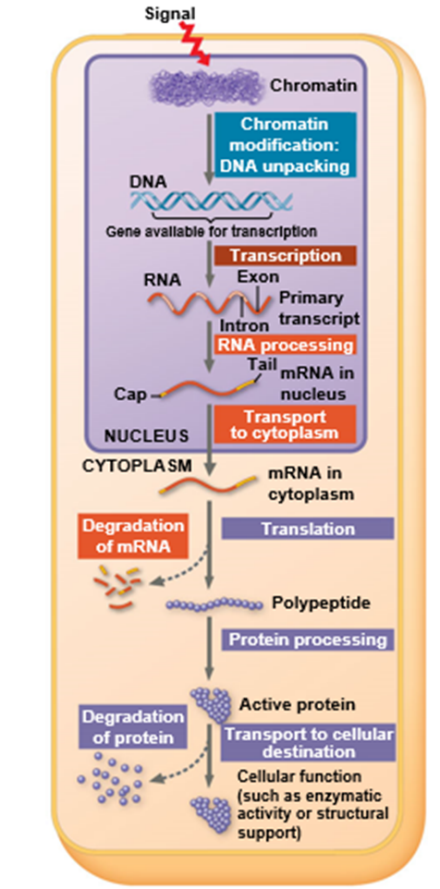

# Molecular Genetics

**จุดประสงค์**

- **นักศึกษาอธิบายได้ว่า ดีเอ็นเอ, โครโมโซม และยีนคืออะไรและแตกต่างกันอย่างไร**    

**การค้นพบ DNA**

T.H. Morgan ค้นพบว่า**ยีน**อยู่บน**โครโมโซม** ส่วนประกอบสำคัญหลักที่อยู่บนโครโมโซมคือ
โปรตีนและดีเอ็นเอ ทำให้เกิดความสนใจขึ้นว่าอะไรคือสารพันธุกรรม โปรตีนหรือดีเอ็นเอ?  

**การค้นพบสารพันธุกรรมได้รับประโยชน์อย่างมากจากการใช้ไวรัส**

Frederik Griffith ทดลองในปี 1928 โดยใช้แบคทีเรียสองสายพันธุ์
แบบที่ก่อให้เกิดอันตรายและไม่ก่อให้เกิดอันตราย เขาฉีดแบคทีเรียทั้งสองสายพันธุ์ในหนูอย่างละกลุ่ม
การทดลองพบว่าหนูที่ถูกฉีดด้วยแบคที่เรียที่ก่อให้เกิดอันตรายตาย ส่วนอีกกลุ่มไม่ตาย
จากนั้นเขานำแบคทีเรียที่ไม่ก่อให้เกิดอันตรายไปทำให้ตายโดยใช้ความร้อนแล้วฉีดเข้าไปในหนู
ปรากฏว่าหนูไม่ตาย
หนูกลุ่มสุดท้ายถูกฉีดด้วยแบคทีเรียที่ทำให้เกิดโรคที่ทำให้ตายแล้วผสมกับแบคทีเรียที่ไม่ก่อให้เกิดโรคที่ยังไม่ตาย
ปรากฏว่าหนูตาย (รูปที่ 1)

การทดลองนี้ทำให้เกิดปรากฏการณ์ที่เรียกว่า Transformation ซึ่งหมายความว่าเปลี่ยนแปลงของ
genotype และ phenotype ที่เกิดจากดีเอ็นเอแปลกปลอม

**รูปที่ 1** การทดลองของ Griffith     

จากนั้น Oswald, Maclyn, และ McCarty ค้นพบว่าสารที่ก่อให้เกิดการ transformation
นั้นเกิดจากดีเอ็นเอ
แต่นักวิทยาศาสตร์หลายคนยังไม่ได้เชื่อทั้งหมดเพราะข้อมูลเกี่ยวกับดีเอ็นเอในขณะนั้นมีน้อย
ข้อมูลที่ได้ตามมาภายหลังได้มากจากการทดลองโดยใช้ไวรัสกลุ่มที่เรียกว่า bacteriophage
(ไวรัสที่ใช้แบคทีเรียเป็นโฮสต์)

ต่อมาในปี 1952 Alfred Hershey และ Martha Chase ยืนยันว่าสารพันธุกรรมคือดีเอ็นเอ
พวกเขาทดลองโดยใช้ bacteriophage (หรือย่อว่า phage, อ่านว่า เฟจ)
เขาใช้ส่วนประกอบของเฟจคือโปรตีนและดีเอ็นเอฉีดเข้าไปในเซลล์แบคทีเรีย *E. coli*
แล้วนำไปหมุนเหวี่ยง (centrifugation) ทำให้ส่วนที่หนักกว่า เช่นแบคทีเรียตกลงด้านล่าง
เกาะรวมกันเรียกว่า pellet
ขณะที่ส่วนที่เบากว่าลอยอยู่ด้านบนซึ่งรวมถึงอาหารเลี้ยงเชื้อและส่วนประกอบของเฟจ

Hershey เมื่อวัดกัมมันตภาพรังสีพบว่าส่วนด้านบนมีส่วนประกอบของ ^35^S ในขณะที่ส่นด้านล่าง
(pellet) มีส่วนประกอบของ ^32^P (รูปที่ 2) Hershey และ Chase
จึงสรุปว่าดีเอ็นเอเป็นสารพันธุกรรม ไม่ใช่โปรตีน

**รูปที่ 2** การทดลองของ Hershey และ Chase    

## ดีเอ็นเอ (DNA --- Deoxyribonucleic acid)

ดีเอ็นเอเป็น**พอลิเมอร์**ประกอบด้วยนิวคลีโอไทด์ (nucleotides)
ที่เชื่อมต่อกันเป็นสายยาวที่เกิดจากการสร้าง**พันธะ phosphodiester
ระหว่างนิวคลีโอไทด์***บนสายเดียวกัน*

นิวคลีโอไทด์แต่ละโมเลกุลบนสายดีเอ็นเอประกอบด้วยสามส่วนคือ (1) น้ำตาล deoxyribose;
(2) ไนโตรจีนัสเบส (nitrogenous base) ที่มีสี่ชนิด คือ adenine (A), thymine (T),
guanine (G) และ cytosine (C); และ (3) หมู่ฟอสเฟต (phosphate group)

เมื่อปี 1950 Erwin Chargaff
เสนอว่าส่วนประกอบของดีเอ็นเอจะแตกต่างกันในสิ่งมีชีวิตแต่ละสปีชีส์ เขาเสนอกฎสองข้อคือ

1.  ส่วนประกอบของเบสแตกต่างกันในสิ่งมีชีวิตแต่ละสปีชีส์

2.  สัดส่วนของ A จะเท่ากับ T และ G จะเท่ากับ C     

## โครงสร้างของดีเอ็นเอ

Maurice Wilkins และ Rosalind Franklin ใช้เทคนิค X-ray diffraction
หาโครงสร้างของดีเอ็นเอ โดย Franklin ได้ถ่ายรูปดีเอ็นเอด้วยวิธีนี้

หลังจากที่แฟรงคลินเอกซ์เรย์ภาพ crystallographic ของดีเอ็นเอ (รูปที่ 3) ทำให้ต่อมา
Watson ทำนายว่าดีเอ็นเอมีโครงสร้างเป็นขด
ภาพเอกซเรย์ยังช่วยให้วัตสันสามารถสรุปความกว้างของเกลียวและระยะห่างของเบสได้
และแสดงให้เห็นว่าโมเลกุลดีเอ็นเอถูกสร้างขึ้นจากสองเส้นพันกันเป็น**เกลียวคู่ (double
helix)**

**รูปที่ 3** Franklin และภาพ x-ray diffraction ของดีเอ็นเอ     

นิวคลีโอไทด์บนสายดีเอ็นเอสายเดียวกันเชื่อมต่อกันด้วยพันธะฟอสโฟไดเอสเทอร์
(Phosphodiester)
ระหว่างคาร์บอนตัวที่สามบนน้ำตาลกับหมู่ฟอสเฟสที่เกาะที่น้ำตาลตัวที่ห้าของนิวคลีโอไทด์โมเลกุลถัดมา

เพื่อให้เข้าใจโครงสร้าง double helix ของดีเอ็นเอ
ให้นึกภาพเอามือขวาพันรอบโมเลกุลดีเอ็นเอที่แสดงในรูปโดยให้นิ้วหัวแม่มือชี้ขึ้น
นึกภาพนิ้วเลื่อนไปตามด้านนอกของเกลียว
มือของคุณควรเคลื่อนไปพร้อมกับเกลียวขึ้นไปในทิศทางที่นิ้วหัวแม่มือชี้ (รูปที่ 4)

**รูปที่ 4** 3'-5'phosphodiester bond และโครงสร้างของดีเอ็นเอ     

Watson และ Crick เสนอโครงสร้างรูปแบบเกลียวคู่เพื่อให้สอดคล้องกับภาพ X-ray
และคุณสมบัติทางเคมีของดีเอ็นเอ
โดยก่อนหน้านี้แฟรงคลินศึกษาภาพถ่ายดีเอ็นเอของเธอแล้วได้ข้อสรุปว่ามี **backbones**
สองสายอยู่ด้านนอก ซึ่งก็คือส่วนที่เป็นน้ำตาล deoxyribose และหมู่ฟอสเฟต

วัตสันสร้างแบบจำลองที่ backbones เป็นแบบ **antiparallel** (ทิศทางตรงกันข้าม)
เขาระบุว่า adenine (A) จับคู่กับ thymine (T) เท่านั้น และ guanine (G) จับคู่กับ
cytosine (C) เท่านั้น แบบจำลองวัตสันและคริกนี้สามารถอธิบายกฎของ Chargaff
ที่ระบุว่าในสิ่งมีชีวิตใด ๆ จำนวน A = T และจำนวน G = C

**รูปที่ 5**
โครงสร้างของดีเอ็นเอนิวคลีโอไทด์และการจับกันที่เกิดจากพันธะไฮโดรเจนระหว่างเบส A-T และ
G-C บนสายดีเอ็นเอเส้นที่อยู่ตรงข้ามกัน     

เนื่องจากทั้งสองเส้นของดีเอ็นเอประกอบด้วยนิวคลีโอไทด์ที่ทำหน้าที่เป็นแม่แบบสำหรับการสร้างดีเอ็นเอสายใหม่ในการเพิ่มจำนวน
ในการเพิ่มจำนวนดีเอ็นเอนั้นโมเลกุลดีเอ็นเอสองสายเดิมจะคลายออกจากกันและดีเอ็นเอสายใหม่สองเส้นจะถูกสร้างขึ้น
รูปแบบการเพิ่มโมเลกุลของดีเอ็นเอแบบ **semiconservative**
จะทำให้โมเลกุลดีเอ็นเอโมเลกุลใหม่จะมีสายเก่าหนึ่งเส้นและอีกหนึ่งเส้นที่สร้างขึ้นใหม่

**รูปที่ 6** โมเดลของการเพิ่มจำนวนดีเอ็นเอแบบ semiconservative     

## DNA replication การจำลองแบบดีเอ็นเอ

การเพิ่มจำนวนโมเลกุลดีเอ็นเรียกว่า **DNA replication** (replication
แปลว่าการทำซ้ำ การคัดลอก ทำสำเนา) กระบวนการนี้เริ่มขึ้นที่จุดเฉพาะที่เรียกว่า **origin
of replication**
ที่บริเวณนี้สายดีเอ็นเอทั้งสองสายที่ยึดกันอยู่ด้วยพันธะไฮโดรเจนระหว่างคู่เบสจะถูกทำลายทำให้สายดีเอ็นเอสองสายแยกออกจากกันทำให้เกิดลักษณะโป่งพองขึ้นเรียกว่า
"bubble" (โครโมโซมของโปรคาริโอตมีโครงสร้างเป็นวง ส่วนโครโมโซมของยูคาริโอตเป็นแท่ง
บริเวณ origin of replication
ในโครโมโซมแต่ละแท่งของพวกยูคาริโอตอาจมีจำนวนหลายร้อยหรือหลายพันบริเวณ)
การสร้างดีเอ็นเอสายใหม่นี้เกิดขึ้นในทั้งสองทิศทางจากแต่ละ origin of replication
จนกว่าจะคัดลอกโมเลกุลทั้งหมดเสร็จสิ้น

**รูปที่ 7** การเพิ่มจำนวนดีเอ็นเอใน prokaryotes และ eukaryotes     

ส่วนขอบของแต่ละ replication bubble จะเรียกว่า replication fork
มีลักษณะคล้ายรูปตัววาย เอนไซม์ helicase มีหน้าที่คลายเกลียวดีเอ็นเอที่บริเวณ replication
fork นี้ โปรตีน Single strand binding proteins
จะเข้ามาจับและช่วยรักษาให้สายดีเอ็นเอที่ถูกคลายออกคงตัวอยู่ได้ เอนไซม์ Topoisomerase
คลายเกลียวบริเวณที่เป็นเกลียวซ้อนเกลียวของดีเอ็นเอ

**รูปที่ 8** บริเวณ replication fork     

เอนไซม์ DNA polymerases จำเป็นต้องใช้ primer เพื่อจะได้เติมเบสให้กับดีเอ็นเอสายใหม่
primers นี้ถูกสร้างด้วยเอนไซม์ primase เอนไซม์นี้จะสร้าง RNA primers ประมาณ 5-10
เบสก่อน ที่ปลายด้าน 3\'
ของสายดีเอ็นเอสายต้นแบบและจะเป็นบริเวณที่ให้เริ่มต้นการสร้างสายใหม่

เอนไซม์ DNA polymerase นี้มีหน้าที่สังเคราะห์ดีเอ็นเอสายใหม่ที่เริ่มบริเวณreplication
fork เอนไซม์นี้ส่วนใหญ่จำเป็นต้องใช้ primer และสายดีเอ็นเอที่เป็น template
การสังเคราะห์ดีเอ็นเอสายใหม่มีอัตราโดยประมาณที่ 500 นิวคลีโอไทด์ต่อวินาทีในแบคทีเรียและ
50 นิวคลีโอไทด์ต่อวินาทีในคน
นิวคลีโอไทด์แต่ละโมเลกุลที่จะถูกต่อเข้าไปในสายดีเอ็นเอสายใหม่นี้คือ nucleoside
triphosphate เมื่อ nucleoside triphosphate มาต่อกันจะเสียหมู่ฟอสเฟตออกไปสองหมู่

**รูปที่ 9** Dephosphorylation     

DNA polymerase จะต่อนิวคลีโอไทด์ที่ปลาย 3\' เท่านั้น
นั่นคือสายดีเอ็นเอสายใหม่จะถูกสร้างจากปลาย 5\' ไป 3\'

**รูปที่ 10** DNA replication ของ leading strand     

ลักษณะที่เป็น antiparallel
ของดีเอ็นเอนี้ทำให้การสังเคราะห์ดีเอ็นเอสายใหม่ทั้งสองสายมีกระบวนการต่างกันเล็กน้อย
โดยสายดีเอ็นเอที่สร้างใหม่สายหนึ่งจะถูกสร้างได้ต่อเนื่องจาก 5\' ไป 3\' ซึ่งเรียกว่า
**leading strand** แต่อีกสายจะถูกสร้างทีละน้อยจากปลาย 5\' ไป 3\' เช่นกัน เรียกว่า
**lagging strand** ดีเอ็นเอสายใหม่ที่ถูกสร้างบนสาย lagging strand
นี้จะถูกสร้างเป็นช่วงสั้น ๆ ที่เรียกว่า **Okazaki fragments**
ซึ่งจะถูกเชื่อมเข้าด้วยในภายหลังด้วยเอนไซม์ DNA ligase

**รูปที่ 11** การสร้างดีเอ็นเอสายใหม่บน lagging strand     

**สรุปกระบวนการจำลองดีเอ็นเอ DNA replication**

**รูปที่ 12** การจำลองดีเอ็นเอ     

**รูปที่ 13** เอนไซม์ที่ใช้ในกระบวนการจำลองดีเอ็นเอ     

ดีเอ็นเอที่ถูกสร้างใหม่จะถูกตรวจสอบความถูกต้องของลำดับเบส (**proofreading**)
ด้วยเอนไซม์ DNA polymerase
นิวคลีโอไทด์ที่ผิดพลาดจะถูกตัดออกเพื่อเปลี่ยนนิวคลีโอไทด์ใหม่เข้าไปแทนที่ด้วยเอนไซม์ nuclease
ดีเอ็นเอสามารถถูกทำลายด้วยสารเคมีหรือทางกายภาพเช่นรังสีเอ็กซ์หรือควันบุหรี่
การเปลี่ยนแปลงบนสายดีเอ็นเอเกิดขึ้นได้อย่างรวดเร็ว

**รูปที่ 14** การตัดนิวคลีโอไทด์ออกแล้วแทนที่ด้วยนิวคลีโอไทด์ใหม่     

อัตราความผิดพลาดหลังจากการถูกตรวจสอบ (proofreading) ด้วยเอนไซม์ DNA polymerase
นั้นมีค่าต่ำมาก แต่ไม่ได้แปลว่าจะไม่ความผิดพลาดเลย ลำดับเบส (**sequence**)
ที่เกิดการเปลี่ยนแปลงอาจอยู่ถาวร และถ่ายทอดไปยังรุ่นต่อไปได้หากเกิดในเซลล์สืบพันธุ์
การเปลี่ยนแปลง (**mutations**)
นี้เป็นสาเหตุของความหลากหลายทางพันธุกรรมซึ่งอาจทำให้เกิดสิ่งมีชีวิตสปีชีส์ใหม่ขึ้นได้

การจำลองดีเอ็นเอจาก 5\' ไป 3\' นั้นทำให้ไม่มีทางที่จะมีการจำลองปลาย 5\' ได้ครบถ้วน
ทำให้ปลาย 5\' นี้สั้นลงทุกครั้งที่มีการเพิ่มจำนวนดีเอ็นเอ ปัญหานี้เกิดขึ้นใน eukaryotes
เท่านั้นแต่ไม่ใช่ใน prokaryotes เพราะในสิ่งมีชีวิตกลุ่มนี้มีโครโมโซมเป็นวงกลม

**รูปทื่ 15** การสั้นลงของปลาย 5'     

ดีเอ็นเอคือพอลิเมอร์ของนิวคลีโอไทด์ที่ประกอบไปด้วยเบสสี่ชนิดเรียงกันเป็นลำดับ (sequence)
บางส่วนของดีเอ็นเอทำหน้าที่เป็นรหัสสำหรับสร้างโปรตีนและ RNA ชนิดต่าง ๆ
และบางส่วนของสายดีเอ็นเอนี้ไม่ได้มีหน้าที่ใด ๆ

เราเรียกบริเวณของดีเอ็นเอที่เป็นรหัสสำหรับสร้างโปรตีนและ RNA ต่าง ๆ นั้นว่ายีน (gene)
หรือ coding sequence และเรียกลำดับอื่น ๆ บนสายดีเอ็นเอที่ไม่ได้ทำหน้าที่ใด ๆ ว่า
non-coding sequence โดยในสิ่งมีชีวิตพวก prokaryotes นั้น ยีนต่าง ๆ
มักอยู่ใกล้กันเพราะสิ่งมีชีวิตพวกนี้มีจีโนมขนาดเล็ก ในขณะที่สิ่งมีชีวิตพวก eukaryotes นั้นยีนต่าง
ๆ มักอยู่ห่างกัน

**รูปที่ 16**
ส่วนของดีเอ็นเอที่แสดงบริเวณที่เป็นยีนที่เน้นด้วยสีส้มและสีฟ้าและส่วนของดีเอ็นเอที่เป็น
non-coding sequence ที่แสดงด้วยสีดำ     

**โครโมโซมประกอบด้วยโมเลกุลของดีเอ็นเอที่อัดไปด้วยโปรตีน**

ในโครโมโซมที่เป็นแท่งของ eukaryotes นั้นจะมีส่วนปลายที่เรียกว่า telomeres
ซึ่งส่วนปลายที่เรียกว่า telomeres นี้ไม่ได้ช่วยป้องกันการสั้นลงของดีเอ็นเอ
แต่ช่วยให้ยีนที่อยู่บนดีเอ็นเอโดยเฉพาะยีนที่อยู่ใกล้ ๆ ปลายไม่สั้นลงเร็วกว่าที่ควร
การสั้นลงของปลาย terlomeres นี้มีความสัมพันธ์กับอายุ โดยเอนไซม์ telomerase
ช่วยในการสร้างปลาย telomeres ในเซลล์สืบพันธุ์

**รูปที่ 17** โครโมโซมที่แสดงส่วนของ telomeres ที่ถูกย้อมด้วยสีฟลูออเรสเซนส์สีแดง     

โครโมโซมแบคทีเรียและอาร์เคียมีรูปร่างเป็นวงมีโปรตีนเกาะอยู่บ้าง
โครโมโซมของสิ่งมีชีวิตพวกนี้มักขดกันเป็นแบบ supercoiled
และพบได้ในบริเวณของเซลล์ที่เรียกว่านิวคลีออยด์ เนื่องจากโปรคาริโอตไม่มีนิวเคลียส

โครโมโซมยูคาริโอตมีโมเลกุลของดีเอ็นเอเป็นแบบเส้น
มีโปรตีนเกาะจำนวนมาก ดีเอ็นเอในเซลล์ยูคาริโอตจะจับกับโปรตีนทำให้เกิดเป็น**เส้นใยโครมาติน**
โปรตีนที่เรียกว่าฮิสโตนมีหน้าที่จับกับดีเอ็นเอทำให้ดีเอ็นเอพันขดกันได้
เส้นใยโครมาตินที่ขดพันกันนี้เมื่อคลี่กางออกคล้ายจะดูคล้ายสายลูกปัด (beads on a string)
แต่ละ"ลูกปัด" เป็นโครงสร้างที่เรียกว่านิวคลีโอโซม (nucleosome) ซึ่ง nucleosome
แต่ละหน่วยประกอบด้วยโปรตีนฮิสโตนสี่ชนิด ชนิดละสองโมเลกุล ทำให้ในหนึ่ง nucleosome
มีฮิสโตนทั้งสิ้นแปดโมเลกุล และปลายหางของโปรตีนฮิสโตนจะยื่นออกมาจาก nucleosome
โดยที่ปลายหางของโปรตีนฮิสโตนนี้มีส่วนเกี่ยวข้องในการควบคุมการแสดงออกของยีน (gene
expression)

**รูปที่ 18** การบรรจุโครมาตินใน eukaryotes     

โครมาตินมีการเปลี่ยนแปลงไปตามวัฏจักรของเซลล์ ในการแบ่งเซลล์ระยะinterphase
เส้นใยโครมาตินจะมีขนาดราว ๆ 10 นาโนเมตร และบางส่วนมีขนาดราว ๆ 30
นาโนเมตรโดยการม้วนขดกันของเส้นใยโครมาติน ส่วนของโครมาตินที่มีการขดอัดกันหลวม ๆ
เรียกว่า euchromatin ส่วนโครมาตินในช่วง interphase บางส่วนจะอัดกันแน่นเรียกว่า
heterochromatin ซึ่งมักพบนบริเวณ centromeres และ telomeres ของโครโมโซม
ส่วนที่เป็น heterochromatin
ที่อัดกันอย่างหนาแน่นนี้ทำให้ยีนที่อยู่ในบริเวณนี้เกิดการแสดงออกได้ยากกว่ายีนที่อยู่ในบริเวณ
euchromatin 

## แบบฝึกหัด

Hershey and Chase ยืนยันว่า DNA เป็นสารพันธุกรรมด้วยการทดลองใด

A.  DNA linkage mapping

B.  Transformation of DNA in Streptococcus pneumoniae

C.  X-ray crystallography of DNA molecules

D.  Radio-labelling DNA and protein

Template strand ของสายดีเอ็นเอมีลำดับเบสเป็น 3\' TAGGCATTGCA 5\'
สายดีเอ็นเอที่สร้างขึ้นจากสายดีเอ็นเอต้นแบบนี้คืออะไร?

A.  5\' ATCCGTAACGT 3\'

B.  5\' AUCCGUAACGU 3\'

C.  5\' TAGGCATTGCA 3\'

D.  5\' TGCAATGCCTA 3\'

ข้อใดต่อไปนี้จับคู่เอนไซม์จำลองดีเอ็นเอกับหน้าที่ได้อย่างถูกต้อง

A.  Topoisomerases ทำงานนำหน้า replication fork เพื่อป้องกัน supercoiling

B.  DNA polymerase ฉันแยกสาย DNA ที่ replication fork

C.  Helicase เชื่อมระหว่างชิ้นส่วนดีเอ็นเอ

D.  DNA primase เพิ่มไพรเมอร์โดยการเพิ่มนิวคลีโอไทด์ให้กับ 3\'     

**อ่านเพิ่มเติม**

- Concepts of Biology on OpenStax.
  https://openstax.org/books/concepts-biology/pages/9-introduction

- Discovery of DNA on Khan academy.
  https://www.khanacademy.org/science/biology/dna-as-the-genetic-material/dna-discovery-and-structure/a/classic-experiments-dna-as-the-genetic-material

- Watson, J. D., and F. H. C. Crick. \"{width="8.333333333333333e-3in"
  height="8.333333333333333e-3in"}Molecular Structure of Nucleic
  Acids.\" *Nature* 1953 Apr 25; 171 (4356): 737--8.

- Molecular Visualizations of DNA.
  https://www.wehi.edu.au/wehi-tv/molecular-visualisations-dna

- DNA replication. https://www.youtube.com/watch?v=4jtmOZaIvS0

- The Central Dogma of Biology.
  https://www.youtube.com/watch?v=9kOGOY7vthk

      

# Central dogma: transcription and translation

**จุดประสงค์**

- **นักศึกษาอธิบายกระบวนการ transcription และ translation ได้**     

โมเลกุลของดีเอ็นเอไม่ได้เป็นเพียงสายนิวคลีโอไทด์ที่ยาวและน่าเบื่อ
แต่จะแบ่งออกเป็นหน่วยการทำงานที่เรียกว่ายีน ส่วนมากผลิตภัณฑ์ที่ใช้งานได้ของยีนคือโปรตีน เช่น
ยีนสีดอกไม้ของเมนเดลให้ข้อมูลเป็นโปรตีนที่ช่วยสร้างเม็ดสีในกลีบดอกไม้
ดังนั้นโดยปกติแล้วเราจึงสรุปว่ายีนเป็นส่วนของดีเอ็นเอที่เอาไว้สร้างโปรตีน
และบริเวณของดีเอ็นเอที่ไม่ใช่ยีนนั้นเรียกว่า non-coding region หรือ non-coding
sequence

ผลิตภัณฑ์ที่ใช้งานได้ของยีนที่รู้จักกันมากที่สุดคือโปรตีนหรือพอลิเปปไทด์ (polypeptides)
พอลิเปปไทด์คือพอลิเมอร์ของเปปไทด์ซึ่งก็คือพอลิเมอร์ของกรดอะมิโน แม้ว่าโปรตีนหลายชนิดประกอบด้วยพอลิเปปไทด์เดียว
แต่โปรตีนบางชนิดก็ประกอบด้วยพอลิเปปไทด์หลายตัว
ยีนที่ให้ผลิตภัณฑ์เป็นพอลิเปปไทด์เรียกว่ายีนที่สังเคราะห์โปรตีน (protein-coding genes)
ไม่ใช่ยีนทั้งหมดที่ให้พอลิเปปไทด์ แต่ยีนบางตัวช่วยให้เกิดการสังเคราะห์โมเลกุล RNA เช่น
transfer RNAs และ ribosomal RNA     

**DNA 🡺 RNA 🡺 protein**

ข้อมูลทางพันธุกรรมในเซลล์จากดีเอ็นเอ 🡺 เกิด transcription ได้เป็น mRNA 🡺 เกิด
translation ได้เป็นโปรตีน     

## หลักการของ transcription และ translation

- RNA เป็นตัวกลางเชื่อมระหว่างยีนและโปรตีน

- Transcription เป็นการสังเคราะห์ mRNA โดยใช้ลำดับเบสใน DNA สายใดสายหนึ่ง

- Transcription สร้าง mRNA

- Translation เป็นการสังเคราะห์พอลิเปปไทด์ที่ใช้ข้อมูลใน mRNA

- ไรโบโซมเป็นที่ที่เกิดของ translation

- กระบวนการ Translation ของ mRNA ในโปรคาริโอต สามารถเริ่มได้ก่อนที่
  transcription จะเสร็จสิ้น

- Nuclear envelope ในเซลล์ยูคาริโอตแยก transcription ออกจาก translation
  ดังนั้นจะต้องรอให้เกิด transcription ในนิวเคลียสให้เสร็จก่อนแล้วจึงเกิด translation
  ในไซโทพลาซึม

- mRNA ที่ได้จาก transcription ในเซลล์ของพวก eukaryotes มีการแก้ไขต่อเติมที่เรียกว่า
  RNA processing เพื่อให้ได้ mRNA ที่สมบูรณ์

**รูปที่ 1** ภาพรวมของ transcription และ translation ในโปรคาริโอตและยูคาริโอต     

**รูปที่ 2** กระบวนการ Transcription ใช้ดีเอ็นเอสายต้นแบบเพียงสายเดียวและ
Translation ที่ต้องใช้ลำดับเบสบนสาย mRNA ที่เรียกว่า Codons     

## Codons

หนึ่งในสองสายของดีเอ็นเอจะเป็นต้นแบบ (template) ในกระบวนการ transcription
เพื่อสร้าง mRNA โดยยีนยีนหนึ่งใช้ดีเอ็นเอสายต้นแบบเพียงสายเดียวเท่านั้น สมมติให้ยีน A
ใช้ดีเอ็นเอสายหนึ่งเป็นต้นแบบก็จะใช้สายนั้นเพื่อสร้าง mRNA ไปตลอด
ไม่มีการสลับใช้สายดีเอ็นเอคนละสาย และในระหว่างกระบวนการ translation
ที่เกิดที่ไรโบโซมในไซโทพลาซึมนั้น codons ซี่งเป็นเบสสามตัวเรียงกันที่อยู่บนสาย mRNA
จะถูกอ่านจากปลาย 5\' ไป 3\' เสมอ

ดีเอ็นเอสายที่ไม่ใช่ตัวแบบ (non-template strand) ถูกเรียกว่า coding strand
เพราะว่าลำดับเบส (sequence) บนสายดีเอ็นเอสายนี้จะมีลำดับเหมือนกับสาย mRNA
ที่ถูกสร้างขึ้นมา ยกเว้นมีเบส U มาแทนที่เบส T แต่ละโคดอนจะเป็นรหัสของกรดอะมิโน

โคดอน 61 โคดอนให้รหัสสำหรับกรดอะมิโน ส่วนอีก 3 โคดอนจะให้รหัส "หยุด"
เพื่อให้ยุติกระบวนการ translation โคดอนมากกว่าหนึ่งตัวอาจระบุกรดอะมิโนชนิดเดียวกันได้
(redundancy)

รหัสพันธุกรรมมีความเกือบเป็นสากล (universal) ร่วมกันจากแบคทีเรียไปจนถึงสัตว์ที่ซับซ้อน
เราจึงสามารถถ่ายทอดยีนจากสิ่งมีชีวิตชนิดหนึ่งไปยังสิ่งมีชีวิตอีกชนิดหนึ่งได้โดยยีนนั้นยังสามารถให้โปรตีนที่มีลำดับกรดอะมิโนเหมือนเดิม

**รูปที่ 3** ตาราง Codon     

## Transcription เป็นขั้นตอนแรกของการแสดงออกของยีน

การสังเคราะห์ RNA ต้องใช้เอนไซม์ **RNA polymerase**
ซึ่งจะแยกสายดีเอ็นเอสองสายออกจากกันและต่อโมเลกุลของ RNA nucleotides (A, U, G
และ C) ให้เป็นสายยาว สาย RNA ที่สังเคราะห์นี้จะเข้ากันได้ (complement)
กับสายดีเอ็นเอที่เป็นต้นแบบ (ยกเว้นไม่มี Thymine แต่มี Uracil แทน) เอนไซม์ RNA
polymerase นี้ไม่ต้องใช้ RNA primers (ต่างจาก DNA polymerase ที่ต้องใช้ RNA
primers)

**รูปที่ 4** ภาพรวมของ transcription     

- บริเวณของดีเอ็นเอสายต้นแบบที่ RNA polymerase เข้ามาจับเรียกบริเวณนั้นว่า
  **promoter**

- บริเวณของดีเอ็นเอที่เกิด transcription เรียกว่า transcription unit

- ลำดับเบสบนสายดีเอ็นเอต้นแบบที่ส่งสัญญาณให้หยุด transcription ในแบคทีเรียเรียกว่า
  terminator

- กระบวนการ Transcription ทั้งหมดมีสามระยะ ได้แก่ initiation เริ่ม, elongation
  ต่อ และ termination หยุด

โปรโมเตอร์ที่เป็นจุดเริ่มต้นของกระบวนการ transcription
นี้จะอยู่ด้านหน้าบริเวณที่จะถูกถอดรหัสไปประมาณหนึ่ง และจะมีโปรตีนที่เรียกว่า transcription
factors ช่วยจับดีเอ็นเอสายต้นแบบและเอนไซม์ RNA polymerase โดยทั้ง RNA polymerase
และ transcription factors นี้เมื่อจับกันแล้วจะรวมเรียกว่า transcription
initiation complex

ในสิ่งมีชีวิตพวก eukaryotes บริเวณของโปรโมเตอร์มีส่วนที่เรียกว่า TATA box
ซึ่งเป็นบริเวณที่สำคัญในการทำให้เกิด transcription initiation complex

**รูปที่ 5** Transcription initiation ใน eukaryotes     

RNA polymerase จะทำหน้าที่คลายเกลียวของดีเอ็นเอพร้อมกับเคลื่อนที่ไปบนดีเอ็นเอสายต้นแบบ
ยีนหนึ่ง ๆ สามารถถูกถอดรหัสได้พร้อม ๆ กันด้วย RNA polymerase หลาย ๆ โมเลกุล
นิวคลีโอไทด์จะถูกเพิ่มไปทางด้าน 3\' ของ RNA ที่กำลังถูกสังเคราะห์

**รูปที่ 6** Elongation     

แบคทีเรียและ eukaryotes มีกระบวนการหยุด (termination) การสังเคราะห์ RNA
ที่แตกต่างกัน ในแบคทีเรีย RNA polymerase จะหยุด transcription
ที่บริเวณที่มีสัญญาณให้หยุด (terminator) และ mRNA ที่ได้จะนำไปแปลรหัส(translate)
ทันทีโดยไม่ต้องเปลี่ยนแปลงใด ๆ แต่ใน eukaryotes นั้นการหยุดการสังเคราะห์ mRNA เกิดเมื่อ
RNA polymerase II ถอดรหัสให้เบสที่มีแต่เบส A ซ้ำ ๆ กัน (polyadenylation signal)     

## RNA processing

RNA ของ eukaryotes ที่สังเคราะห์ได้จะถูกตกแต่งจาก pre-mRNA ให้กลายเป็น mRNA
ที่พร้อมใช้งานโดยกระบวนการที่เรียกว่า RNA processing ที่เกิดในนิวเคลียส ในกระบวนการ
RNA processing นี้ pre-mRNA จะถูกตกแต่งส่วนมากด้วยการตัดและต่อ

ส่วนปลายของ pre-mRNA มีการตกแต่งโดยที่ปลาย 5\' จะมีการเติมนิวคลีโอไทด์ที่เรียกว่า
**cap** ขณะที่ปลาย 3\' มีการเติม **poly-A tail** การเติมนี้ช่วยนำทางให้ mRNA ออกสู่
cytoplasm ช่วยให้ mRNA ไม่ถูกทำลาย และช่วยให้ไรโบโซมเกาะที่ปลาย 5\'

**รูปที่ 7** RNA processing, 5\' cap และ 3\' poly-A tail     

ในบางกรณีส่วนประกอบที่เรียกว่า spliceosome ซึ่งประกอบด้วยโปรตีนและ RNA ชนิดที่เรียกว่า
small RNA จะเข้ามาช่วยตัดและต่อสาย pre-mRNA

**รูปที่ 8** Spliceosome     

**Introns** บางชนิดมีลำดับเบสที่อาจควบคุมการแสดงออกของยีน ยีนบางชนิดสามารถถอดรหัสให้สาย
polypeptide ได้มากกว่าหนึ่งชนิด ขึ้นอยู่กับว่าจะเอาส่วนใดของ pre-mRNA เป็น
exons และเอาส่วนใดเป็น introns การเลือก intron-exon นี้เรียกว่า alternative RNA
splicing ดังนั้นจำนวนโปรตีนที่สิ่งมีชีวิตสามารถผลิตได้จึงมากกว่าจำนวนยีนมาก

โปรตีนมักจะมีส่วนที่มีคุณสมบัติแตกต่างกันเรียกว่าโดเมน exon ต่างกันมักจะให้โดเมนที่ต่างกันด้วย
exon ที่เปลี่ยนแปลงไปจึงอาจทำให้เกิดโปรตีนใหม่ ๆ

**รูปที่ 9** Exons และโดเมนของโปรตีน     

## Translation: mRNA 🡺 โปรตีน

**รูปที่ 10** Translation โดยใช้ไรโบโซม     

Transfer RNA (tRNA) นำกรดอะมิโนมาเพื่อสร้างสาย polypeptide ที่เกิดขึ้นบนไรโบโซม
โดย tRNA แต่ละโมเลกุลมีหน้าที่นำกรดอะมิโนเฉพาะตัวของมันเพราะส่วนของ anticodon
ที่อยู่บน tRNA จะต้อง complement กับส่วนของ codon ที่อยู่บนสาย mRNA

**รูปที่ 11** โครงสร้างของ tRNA     

Translation จำเป็นต้องใช้ความจำเพาะของสองอย่างคือ ความจำเพาะระหว่าง tRNA
และกรดอะมิโน และระหว่าง anticodon ของ tRNA กับ codon ของ mRNA

**รูปที่ 12** เอนไซม์ aminoacyl-tRNA synthetases ทำหน้าที่เชื่อมกรดอะมิโนกับ tRNA     

หน่วยย่อยของไรโบโซม (เล็กและใหญ่) ประกอบด้วยโปรตีนและ ribosomal RNA (rRNA)
ไรโบโซมมีสามบริเวณที่ใช้จับกับ tRNA

- P จับ tRNA ที่มีสาย ***p***olypeptide ที่กำลังต่อ

- A จับ tRNA ที่มีกรดอะมิโน (***a***mino acid) ที่จะเข้ามาต่อเป็นลำดับถัดไป

- E ทางออก (***e***xit) ของ tRNA ที่ใช้แล้ว

**รูปที่ 13** บริเวณที่ทำหน้าที่ของไรโบโซม     

Translation มีสามขั้นตอน คือ initiation เริ่ม, elongation ต่อ และ termination
หยุด ทั้งสามขั้นตอนจำเป็นต้องใช้โปรตีนเพื่อช่วยในกระบวนการ รวมถึงต้องใช้พลังงานด้วย

- AUG เป็นโคดอนที่เริ่มกระบวนการ translation

- หน่วยย่อยเล็ก (small subunit) ของไรโบโซมเข้าจับกับ mRNA และ tRNA

- หน่วยย่อยเล็กของไรโบโซมเคลื่อนที่ไปบน mRNA จนถึง start codon

- โปรตีนที่เป็น initiation factor นำหน่วยย่อยใหญ่ (large subunit)
  ของไรโบโซมเข้ามา ทำให้ translation initiation complex สมบูรณ์

**รูปที่ 14** การเริ่มกระบวนการ translation     

ในระหว่างช่วง elongation กรดอะมิโนจะถูกเพิ่มเข้าไปครั้งละหนึ่งโมเลกุลที่ปลาย
C-terminus ของสาย polypeptide โปรตีนที่เรียกว่า elongation factors
มีส่วนช่วยในการเพิ่มโมเลกุลกรดอะมิโนเข้าไปในสาย ช่วง elongation
นี้แบ่งได้เป็นสามระยะย่อย ได้แก่การจดจำของโคดอน การเกิดพันธะเปปไทด์
และการเคลื่อนย้ายของกรดอะมิโน มีการใช้พลังงานในระยะย่อยที่หนึ่งและสาม

กระบวนการแปลรหัส translation นี้ดำเนินไปจาก 5\' ไป 3\' ของสาย mRNA

**รูปที่ 15** Elongation     

เมื่อถึง Stop codon ที่บริเวณ A ของไรโบโซม โปรตีนที่เรียกว่า release factor จะเข้ามา
โปรตีนนี้นำน้ำเข้ามาต่อกับสาย polypeptide ทำให้สาย polypeptide หลุดออก
รวมถึงส่วนประกอบทั้งหมด

![1) A ribosome reach a stop codon on mRNA. A ribosome is shown, with an
mRNA strand between the large and small subunits. A tRNA with a
polypeptide is in the P site, and the section of mRNA that aligns with
the A site is labeled Stop Codon (U A G, U A A or U G A). A release
factor is bound to the stop codon in the A site. 2) Release factor
promotes hydrolysis. The tRNA that was in the P site no longer has a
polypeptide bound, and the tRNA is released. The free polypeptide is
shown, and was released from the ribosome. The release factor is bound
to the A site of the ribosome. 3) Ribosomal subunits and other
components dissociate. 2 GTP react to form 2 GDP and 2 inorganic
phosphate. The large subunit separates from the small subunit, and
releases the mRNA. The release factor separates from the mRNA and is
released.](images/media/image42.png)

**รูปที่ 16** Termination     

โปรตีนที่ได้จากกระบวนการ translation นี้มักจะยังทำงานไม่ได้ โดยสาย polypeptide
นี้จะต้องถูกตกแต่งก่อนหรือถูกส่งไปยังบริเวณจำเพาะต่าง ๆ ภายในเซลล์ สาย polypeptide
จะเริ่มพับและบิดทำให้เกิดรูปร่างต่าง ๆ เช่นโครงร่างทุติยภูมิและตติยภูมิ
โครงสร้างเหล่านี้ถูกกำหนดโดยยีน กระบวนการที่เรียกว่า post-translational
modifications มีความสำคัญก่อนที่โปรตีนจะสามารถทำงานได้

สาย mRNA สายหนึ่งสามารถมีไรโบโซมหลายอันมาแปลรหัสพร้อม ๆ กันได้ เรียกว่า
polyribosome หรือ polysome การมี polyribosome ทำให้เซลล์ได้ polypeptide
ได้จำนวนมากในเวลาสั้น

**รูปที่ 17** polyribosome หรือที่เรียกว่า polysome     

เซลล์แบคทีเรียสามารถเกิด transcription และ translation ไปพร้อม ๆ กันได้
โปรตีนที่ได้จึงสามารถไปทำหน้าที่ของมันได้รวดเร็ว

ใน eukaryotes มีเยื่อหุ้มนิวเคลียสที่แบ่งกระบวนการทั้งสองออกจากกัน และ RNA
ที่ได้ยังต้องผ่านกระบวนการต่าง ๆ จึงออกจากนิวเคลียสไปสู่ไซโทพลาซึมเพื่อเกิด translation

**รูปที่ 18** Transcription และ translation ในแบคทีเรีย     

**รูปที่ 19** สรุปกระบวนการ transcription และ translation ใน eukaryotes     

## Mutations

การเปลี่ยนแปลงเบสหนึ่งหรือหลายเบสสามารถเปลี่ยนแปลงโครงสร้างและหน้าที่ของโปรตีนได้
มิวเทชันที่เรียกว่า point mutation เป็นการเปลี่ยนแปลงเพียงหนึ่งนิวคลีโอไทด์
การเปลี่ยนแปลงนี้สามารถเปลี่ยนแปลงการสร้างและทำให้ได้โปรตีนที่ผิดแปลกไป
โรคsickle-cell เกิดจากการเปลี่ยนแปลงแบบนี้

**รูปที่ 20** Sickle-cell disease     

Point mutations ที่เกิดที่ยีนแบ่งได้เป็น substitution (แทนที่) และ
insertion/deletion (เพิ่ม/ลด)

- Substitution:

> เบสหนึ่งไปแทนที่เบสหนึ่ง ทำให้เบสที่เข้าคู่กันเปลี่ยนแปลงไปด้วย

- Silent mutations
  กรดอะมิโนที่ได้ไม่เปลี่ยนแปลงจากของเดิมเนื่องจากหนึ่งกรดอะมิโนมีได้หลายโคดอน

- Missense mutations กรดอะมิโนที่ได้เปลี่ยนแปลงไปจากเดิม

- Nonsense mutations เปลี่ยนโคดอนเดิมให้เป็น stop codon
  ส่วนมากโปรตีนที่ได้ไม่สามารถทำงานได้

**รูปที่ 21** Silent mutation     

- Insertion/deletion

> นิวคลีโอไทด์เพิ่มขึ้นมาหรือหายไป การเปลี่ยนแปลงแบบนี้ทำให้มีผลกระทบต่อโปรตีนมากกว่า
> substitutions เพราะการเปลี่ยนแปลงแบบนี้ส่งผลต่อลำดับการอ่าน reading frame
> ซึ่งทำให้เกิด frameshift mutation

**รูปที่ 22** Mutations     

สารเคมีหรือการเปลี่ยนแปลงทางกายภาพก็มีส่วนให้เกิด mutations carcinogens ส่วนมากเป็น
mutagens และ mutagens ส่วนมากเป็น carcinogens   

## แบบฝึกหัด

ลำดับเบสของ mRNA เป็น 5\' ACG AAA GAU 3\' จงหาลำดับกรดอะมิโน

A.  Thr - Lys - Asp

B.  Cys - Phe - Leu

C.  Thr - Asn - Glu

D.  Cys - Lys - Glu

ลำดับเบสของ mRNA เป็น 5\' AAA AUG AGU AAG 3\' จงบอกลำดับเบสบนสาย template
ดีเอ็นเอ

A.  3\' AAA ATG AGT AAG 5\'

B.  3\' TTT TAC TCA TTC 5\'

C.  3\' TTT ATG TGC TTC 5\'

D.  3\' UUU TAC UCA UUC 5\'       

# การควบคุมการแสดงออกของยีน

**จุดประสงค์**

- **นักศึกษาสามารถยกตัวอย่างการควบคุมการแสดงออกของยีนในระยะ[ก่อน]{.underline}และ[หลัง]{.underline}การเกิด
  transcription ได้**     

เราเรียกว่ายีนมี**การแสดงออก**เมื่อมีการเกิด transcription แล้วได้เป็น mRNA แล้วนำ
mRNA ไปสร้างเป็นโปรตีน

Prokaryotes และ eukaryotes
ควบคุมการแสดงออกของยีนในการตอบสนองต่อสภาพแวดล้อมได้อย่างแม่นยำ ใน eukaryotes
การแสดงออกของยีนเป็นกระบวนการหนึ่งที่มีหน้าที่ควบคุมการเจริญและทำให้เกิดความแตกต่างของเซลล์
(eukaryotes ที่มีหลายเซลล์นั้นมีเซลล์เจริญไปทำหน้าที่แตกต่างกันเช่นเซลล์ประสาท
เซลล์เม็ดเลือดขาว ซึ่งเซลล์เหล่านี้มีดีเอ็นเอที่มีลำดับเบสเหมือนกัน) ดังนั้น RNA
ที่ได้จึงมีบทบาทมากในการควบคุม**การแสดงออกของยีน**ในยูคาริโอต

แบคทีเรียและพวกโปรคาริโอตผลิตเฉพาะโปรตีนและสารที่จำเป็นสำหรับเซลล์เท่านั้น เซลล์สามารถควบคุมการผลิตของโปรตีน
เช่นเอนไซม์ โดยการยับยั้งแบบลบ (negative feedback)
หรือโดยการควบคุมยีน กลไกหนึ่งในการควบคุมการแสดงออกของยีนในแบคทีเรียคือ **operon**

**รูปที่ 1** การควบคุม metabolic pathway     

## Operons

คือ[กลุ่มของยีน]{.underline}ที่มีหน้าที่คล้ายกันและมีการทำงานร่วมกันโดยมีการควบคุมโดย
"on-off switch" สวิตช์นี้คือบริเวณของดีเอ็นเอที่เรียกว่า **Operator**
ซึ่งปรกติจะอยู่ในส่วนที่เรียกว่า Promotor โดย Operon
นี้ใช้เรียกส่วนของบริเวณทั้งหมดของดีเอ็นเอที่ประกอบด้วย (1) Operator, (2) Promotor,
และ (3) ยีนที่มันควบคุม

Operon สามารถปิดได้ด้วยโปรตีนที่เรียกว่า repressor ซึ่งโปรตีน repressor
นี้ป้องกันไม่ให้เกิด transcription ของยีนโดยจับเข้ากับส่วนที่เป็น operator
และบล้อกเอนไซม์ RNA polymerase จากการจับกับดีเอ็นเอทำให้เอนไซม์ RNA polymerase
จับกับดีเอ็นเอไม่ได้จึงไม่เกิดกระบวนการ transcription ซึ่งโปรตีน repressor
นี้เป็นผลิตภัณฑ์ของยีนที่ทำหน้าที่ควบคุม (regulatory gene) ซึ่งอยู่ห่างออกไปจาก operon
โปรตีน repressor เป็นได้ทั้ง active form และ inactive form
ขึ้นอยู่กับการมีอยู่ของโมเลกุลอื่น ๆ ที่เกี่ยวข้อง

ยกตัวอย่างเช่น *E. coli* สามารถสังเคราะห์กรดอะมิโน tryptophan
เมื่อกรดอะมิโนตัวนี้มีไม่เพียงพอ โดยปรกติแล้ว *trp* operon
จะเปิดเพื่อให้ยีนที่สังเคราะห์กรดอะมิโนตัวนี้ได้ทำงาน แต่เมื่อเซลล์มีกรดอะมิโน tryptophan
เพียงพอแล้ว โมเลกุลของกรดอะมิโนตัวนี้จะเข้าไปจับกับ *trp* repressor protein
แล้วเข้าไปจับที่ operator ซึ่งจะทำให้ operon นี้ถูกปิด โปรตีน repressor ตัวนี้จึงทำงาน
(active form) เมื่อมี co-repressor คือ tryptophan ดังนั้น operon นี้จะปิด
(repressed) เมื่อระดับของกรดอะมิโนตัวนี้มีสูง

**รูปที่ 2** *trp* operon ในแบคทีเรีย *E. coli*     

Operon มีสองแบบคือ repressible และ inducible operons

- Repressible operon คือ operon ที่ปรกติจะเปิดไว้ มี transcription
  ปกติเพราะไม่มีโปรตีน repressor มาเกาะ ดังนั้นการจับของ repressor ที่ operator
  จะปิดการทำงานของการ transcription ซึ่ง *trp* operon เป็น operon ชนิดนี้

- Inducible operon คือ operon ที่ปรกติจะปิด โปรตีน inducer จับกับโปรตีน repressor
  ทำให้เกิด transcription เช่น *lac* operon ซึ่งปรกติ *lac* repressor จะทำงาน
  (repressor จับอยู่ที่ operator) และปิดการทำงานของ operon แต่เมื่อมีโมเลกุลของ
  inducer โมเลกุลของ inducer นั้นจะเข้าจับกับ repressor ทำให้โปรตีน repressor
  นั้นไม่ทำงานแล้วหลุดออกจาก operator จึงทำให้การถอดรหัสเกิดได้

**รูปที่ 3** *lac* operon ใน *E. coli*     

การควบคุมการแสดงออกของยีนเช่น *trp* และ *lac* operons เป็นการควบคุมแบบ
negative control เนื่องจาก operons ถูกปิดด้วย repressor ที่เป็น active form

**Positive gene regulation**

บาง operons ใช้วิธีการ positive control ผ่านโปรตีนอื่น ๆ เช่น cyclic AMP
receptor protein (CRP) ซึ่งกระตุ้นให้เกิด transcription

เมื่อน้ำตาลกลูโกสหายากขึ้น โปรตีน CRP จะถูกกระตุ้นโดยไปจับกับ cyclic AMP (cAMP) แล้ว
CRP ที่ทำงานได้นี้จะไปจับที่ promotor ของ *lac* operon และจะไปกระตุ้นให้เกิด
transcription มากขึ้น จนเมื่อน้ำตาลกลูโคสในเซลล์มีเพียงพอ CRP จะหลุดออกจาก *lac*
operon และ transcription กลับเข้าสู่ภาวะปกติ

**รูปที่ 4** Positive control ของ *lac* operon โดยใช้ cAMP receptor protein
(CRP)     

## เซลล์ eukaryotic มีการควบคุมการแสดงออกของยีนในหลายขั้นตอน

ยีนถูกเปิดและปิดเพื่อตอบสนองต่อสิ่งเร้าทั้งภายในและภายนอก
การควบคุมการแสดงออกของยีนเป็นสิ่งจำเป็นต่อความหลากหลายของเซลล์ในพวก eukaryotes

**เซลล์เกือบทั้งหมดในสิ่งมีชีวิตมีจีโนมเหมือนกัน**

ความแตกต่างระหว่างเซลล์แต่ละชนิดในสิ่งมีชีวิตเดียวกัน เช่น เซลล์เม็ดเลือดแดง
เซลล์เม็ดเลือดขาว
และเซลล์กล้ามเนื้อลายเป็นผลมาจาก[การแสดงออกของยีนที่แตกต่างกัน]{.underline}
ความผิดปกติในการแสดงออกของยีนที่สามารถนำไปสู่โรครวมทั้งโรคมะเร็ง การแสดงออกของยีนที่ถูกควบคุมหลายขั้นตอน
แต่มักจะขึ้นอยู่กับการควบคุม translation

**รูปที่ 5**
การควบคุมการแสดงออกของยีนสามารถควบคุมได้ในหลายระดับตั้งแต่ในนิวเคลียสจนถึงในไซโทพลาซึม     

## การควบคุมโครงสร้างของโครมาทิน

โครงสร้างของเส้นใยโครมาทิน (เส้นใยโครมาทินคือดีเอ็นเอที่จับกับโปรตีนฮิสโตนแล้วขดพันกัน)
ช่วยในการควบคุมการแสดงออกของยีน ยีนที่อยู่ในบริเวณ **heterochromatin**
จะไม่ได้แสดงออกมากซึ่งตรงข้ามกับยีนที่อยู่ที่บริเวณ **euchromatin**
การเปลี่ยนแปลงที่เกิดที่โปรตีนฮิสโตนและดีเอ็นเอมีผลต่อทั้งโครงสร้างของโปรตีนฮิสโตนและการแสดงออกของยีน

- การเติมหมู่ acetyl
  ที่กรดอะมิโนที่ปลายหางของโปรตีนฮิสโตนจะทำให้เส้นใยโครมาทินคลายออก ทำให้เกิด
  transcription

- การเติมหมู่ methyl
  ลงบนนิวคลีโอไทด์บนสายดีเอ็นเอในสายโครมาทินทำให้โครมาทินขดอัดกันแน่นขึ้นและทำให้ลด
  transcription

**รูปที่ 6** โปรตีนอิสโตนและการเติมหมู่ acetyl     

เมื่อเติมหมู่เมทิลในเบสบนสาย DNA พบว่ามีความเกี่ยวข้องกับการลด transcription
ในบางสปีชีส์ การเติมหมู่เมทิลในดีเอ็นเอสามารถให้ผลกระทบในระยะยาวต่อยีนได้

การเปลี่ยนแปลงที่เกิดบนโปรตีนฮิสโตนไม่ได้ส่งผลต่อลำดับเบสบนดีเอ็นเอ
แต่มันสามารถถ่ายทอดไปยังเซลล์รุ่นต่อไปได้
*การถ่ายทอดลักษณะจากรุ่นหนึ่งไปอีกรุ่นโดยที่ไม่ได้ถูกควบคุมโดยลำดับเบสบนดีเอ็นเอเรียกว่า
epigenetics*     

## การควบคุมการแสดงออกของยีนหลังจาก transcription (post-transcriptional regulation)

**RNA processing**

Pre-mRNA ที่ได้จาก transcription จะเข้าสู่กระบวนการตกแต่งในกระบวนการที่เรียกว่า
alternative RNA splicing แล้วทำให้ได้โมเลกุล mRNA
ที่พร้อมใช้งานได้หลายแบบที่แตกต่างกัน การตัดแต่ง mRNA
ต้นแบบที่แตกต่างกันนั้นขึ้นอยู่กับว่าจะเอาส่วนใดเป็น intron ส่วนใดเป็น exon โดยกระบวนการ
alternative RNA splicing นี้มีความสำคัญมากในจีโนมของ eukaryotes
เนื่องจากไม่จำเป็นต้องมียีนมากแต่ก็ทำให้ได้ mRNA
หลายแบบซึ่งทำให้ได้โปรตีนหลายแบบตามไปด้วย ในคนพบว่ามากกว่า 90%
ของยีนที่สังเคราะห์โปรตีนอาศัยกระบวนการ alternative RNA splicing

**รูปที่ 8** การเกิด alternative RNA splicing ของยีนหนึ่งยีนแต่ทำให้ได้ mRNA
ที่พร้อมใช้งานได้สองแบบที่แตกต่างกันและทำให้ได้โปรตีนสองแบบที่ต่างกันด้วย     

## แบบฝึกหัด

การควบคุมการแสดงออกของยีนสามารถควบคุมได้ที่ระยะใด

A.  ระหว่าง translation

B.  ระหว่าง transcription

C.  หลังจากเกิด translation

D.  หลังจากเกิด transcription

โปรตีนจับกับดีเอ็นเอราว ๆ 100 เบสหน้าบริเวณ promotor ผลที่ได้ทำให้เกิด transcription
ของยีนหนึ่งเป็นจำนวนมาก โปรตีนนี้น่าจะไปจับกับบริเวณใดบนสายดีเอ็นเอ

A.  Operon

B.  Silencer

C.  Enhancer

D.  Repressor       

# DNA technology

## การเพิ่มจำนวนดีเอ็นเอเทคนิค DNA cloning

เป็นการเพิ่มจำนวนดีเอ็นเอโดยนำชิ้นส่วนดีเอ็นเอที่สนใจจะเพิ่มจำนวนเข้าไปแทรกในพลาสมิด
(plasmid) พลาสมิดคือดีเอ็นเอที่เป็นวงที่เพิ่มจำนวนได้
เมื่อตัดพลาสมิดให้ขาดออกแล้วนำชิ้นส่วนดีเอ็นเอที่สนใจแทรกเข้าไป
แล้วเชื่อมต่อชิ้นส่วนทั้งสองเข้าด้วยกันให้กลายเป็นวงเหมือนเดิมด้วยเอนไซม์ DNA ligase
แล้วพลาสมิดนั้นจะถูกเรียกว่า recombinant plasmid ซึ่ง recombinant plasmid
นี้ยังเพิ่มจำนวนไม่ได้ ต้องนำ recombinant plasmid นี้เข้าไปในเซลล์แบคทีเรียก่อน
จากนั้นเมื่อแบคทีเรียแบ่งตัวจากหนึ่งเป็นสองก็จะมีพลาสมิดเพิ่มติดไปในเซลล์ใหม่ด้วย
เมื่อแบคทีเรียแบ่งตัวหลาย ๆ ครั้งก็จะได้ recombinant plasmid ที่มีจำนวนมาก ๆ ด้วย
วิธีการนี้ทำให้ได้ชิ้นส่วนดีเอ็นเอที่ต้องการได้คราวละมาก ๆ
วิธีโคลนนิงนี้นิยมใช้เพื่อเพิ่มจำนวนดีเอ็นเอเพื่อผลิตโปรตีนที่สนใจ

พลาสมิดที่ใช้สำหรับโคลนนิงเรียกว่า cloning vector
พลาสมิดของแบคทีเรียเป็นที่นิยมในการใช้เป็นเวกเตอร์เพราะสามารถนำเข้าเซลล์แบคทีเรียได้ง่าย

**รูปที่ 1** DNA cloning
โดยการนำยีนจากสิ่งมีชีวิตอื่นเข้าไปใส่ในพลาสมิดแล้วนำเข้าสู่เซลล์แบคทีเรียเพื่อให้เซลล์แบคทีเรียสร้างโปรตีนจากยีนที่ใส่เข้าไป     

**รูปที่ 2** การสร้าง recombinant plasmid
โดยตัดพลาสมิดใช้กลายเป็นเส้นด้วยเอนไซม์ตัดจำเพาะแล้วนำยีนหรือชิ้นดีเอ็นเอที่สนใจเข้าไปแทรกแล้วเชื่อมต่อดีเอ็นเอเข้าด้วยกันด้วยเอนไซม์
DNA ligase     

**รูปที่ 3** การแยกขนาดของดีเอ็นเอด้วยเทคนิค Gel electrophoresis     

## การเพิ่มจำนวนดีเอ็นเอด้วยเทคนิค PCR

Polymerase chain reaction (PCR) เป็นการเพิ่มจำนวนดีเอ็นเอบริเวณที่สนใจ
เทคนิคนี้ประกอบด้วยสามขั้นตอน คือ (1) denaturation ใช้ความร้อน (ประมาณ 95 °C)
ทำลายพันธะไฮโดรเจนระหว่างสายดีเอ็นเอทำให้สายดีเอ็นเอออกจากกัน, (2) annealing
ลดความร้อนลง (ประมาณ 50--60 °C) เพื่อให้ DNA primers
สามารถเข้าจับกับดีเอ็นเอบริเวณที่เราสนใจจะเพิ่มจำนวน และขั้นตอนสุดท้ายคือ (3) extension
เป็นการเพิ่มอุณหภูมิ ให้สูงขึ้น (ประมาณ 72 °C) เพื่อให้นิวคลีโอไทด์ (A, T, G และ C)
เข้ามาต่อกับไพร์เมอร์ สามขั้นตอนนี้จะถูกทำซ้ำหลาย ๆ
รอบจนในที่สุดได้จำนวนดีเอ็นเอที่สนใจในปริมาณมาก เทคนิค PCR นี้ใช้เอนไซม์ DNA
polymerase ที่ทนต่อความร้อนได้ดีคือ *Taq* polymerase

**รูปที่ 4** Polymerase Chain Reaction     

**รูปที่ 5** ดีเอ็นเอที่ได้จาก PCR สามารถนำไปใช้สำหรับ gene cloning     

การศึกษาว่ายีนที่สนใจมีการแสดงออกเมื่อไหร่และที่ไหนสามารถทำได้โดยศึกษาผ่าน mRNAs
ที่สร้างขึ้น mRNA สามารถตรวจจับได้เช่นวิธี fluorescence *in situ* hybridization
(FISH) หรือการสกัด mRNA จากเนื้อเยื่อที่สนใจ mRNA ที่สกัดได้จะถูกเปลี่ยนเป็นดีเอ็นเอคู่สมกัน
(complementary DNA ย่อว่า cDNA) โดยใช้เอนไซม์ reverse transcriptase
แล้วนำไปเพิ่มจำนวนโดยใช้ PCR ซึ่งมีชื่อเรียกเฉพาะว่า reverse transcriptase-PCR หรือ
RT-PCR

**รูปที่ 6** การสร้าง complementary DNA     

**รูปที่ 7** Reverse transcription-PCR     

## DNA sequencing

**Sanger sequencing: The chain termination method**

Sanger sequencing ถูกพัฒนาโดย Fred Sanger และคณะในปี 1977
วิธีนี้ยังเป็นที่นิยมในการศึกษาลำดับเบสของยีนหรือลำดับเบสหนึ่งๆ

Sanger sequencing ใช้วิธีคล้ายกับการทำ PCR นั่นคือมีส่วนประกอบคือ

- DNA polymerase

- Primer ที่จับกับส่วนดีเอ็นเอที่สนใจ

- DNA nucleotides (dATP, dTTP, dCTP และ dGTP ที่รวมกันเรียกว่า dNTPs)

- template DNA

แต่ Sanger sequencing จะใช้ส่วนประกอบอีกอย่างเพิ่มเข้ามาจากการทำ PCR ปกติคือ
ddATP, ddTTP, ddCTP และ ddGTP ที่ติดฉลากสีฟลูออเรสเซนส์ไว้เบสละสีรวมเป็นสี่สี โดย
ddNTPs นี้เป็น dideoxy ที่ต่างจาก dNTPs ปกติที่เป็น deoxy และเนื่องจาก dideoxy
ที่ไม่มีออกซิเจนที่คาร์บอนตำแหน่งที่ 3 นี้ทำให้ DNA polymerase ไม่สามารถสร้างพันธะ
phosphodiester เอานิวคลีโอไทด์ตัวต่อไปเข้ามาต่อได้

**รูปที่ 8** ddNTP และ dNTP     

**รูปที่ 9** Sanger sequencing และกราฟที่ได้จากกระบวนการนี้ที่เรียกว่า chromatogram     

**รูปที่ 10** ลำดับเบสบน Chromatogram     

Dideoxy nucleotides มีโครงสร้างคล้ายกับ deoxy nucleotides แต่มันไม่มีหมู่ hydroxyl
ที่คาร์บอนที่ 3\' ในน้ำตาล เมื่อ dideoxy nucleotide ถูกเพิ่มเข้าไปในสายดีเอ็นเอ
เพราะว่ามันไม่มีไฮดรอซิลทำให้นิวคลีโอไทด์มาเชื่อมต่ออีกไม่ได้
สายจึงหยุดอยู่เท่านั้นและเนื่องจากมันได้ติดฉลากสีเอาไว้ เมื่อนำมาอ่านจึงเห็นเป็นลำดับเบส     

## Next Generation Sequencing

"Next Generation Sequencing" (NGS หรือ "massively parallel sequencing")
เป็นชื่อรวม ๆ ของเทคนิคที่ใช้หาลำดับเบสได้คราวละมากๆ เทคนิคการศึกษาจีโนมแบบ NGS
ที่เป็นที่รู้จักได้แก่ Illumina
และปัจจุบันมีเทคนิคที่ทันสมัยยิ่งขึ้นทำให้การอ่านลำดับเบสได้ยาวมากขึ้น ได้แก่ Pacific
Biosciences (PacBio) และ Oxford Nanopore Technologies     

## แบบฝึกหัด

ข้อใดถูกเกี่ยวกับ polymerase chain reaction (PCR)

A.  Denaturation - แยกดีเอ็นเอด้วยอุณหภูมิสูง

B.  Extension -- ลดอุณหภูมิลงเพื่อให้ DNA primers เข้าจับกับ DNA template

C.  Annealing -- นิวคลีโอไทด์เข้ามาต่อจาก primers โดยใช้เอนไซม์ *Taq*
    polymerase

Polymerase chain reaction (PCR)
มีวิธีการคล้ายกับกระบวนการใดที่ทำให้ได้ดีเอ็นเอจำนวนมาก

A.  Translation

B.  Replication

C.  Transcription

D.  Mitosis

 
ผลจาก gel electrophoresis ของสิ่งมีชีวิตสี่ชนิด
ด้านล่างมีแถบ X แถบนี้มีความหมายว่าอย่างไร

A.  DNA ชิ้นใหญ่ที่สุด เคลื่อนที่ได้ช้าสุด

B.  DNA ชิ้นเล็กสุด เคลื่อนที่ช้าสุด

C.  DNA ชิ้นเล็กสุด เคลื่อนที่เร็วสุด

D.  DNA ชิ้นใหญ่ที่สุด เคลื่อนที่ได้เร็วสุด

      

# Genomics

- Genome (gene + -ome) คือยีนทั้งหมดในสิ่งมีชีวิต

- Genomics (gene + -omics)
  เป็นการศึกษาของยีนทั้งหมดและบางครั้งก็อาจรวมไปถึงความสัมพันธ์ระหว่างกัน

- Proteome (protein + -ome) คือโปรตีนที่แสดงออกทั้งหมดภายในเซลล์หรือในกลุ่มของเซลล์

- Proteomics (protein + -omics) การศึกษาโปรตีนและคุณสมบัติของโปรตีน

- Bioinformatics
  การประยุกต์ใช้วิธีการทางคอมพิวเตอร์มาใช้วิเคราะห์และจัดเก็บข้อมูลทางชีวภาพ

  

## การศึกษาจีโนมมนุษย์

Human genome project เริ่มต้นในปี 1990
โปรเจคนี้มีความสำคัญต่อการพัฒนาเทคโนโลยีและกระบวนการศึกษาจีโนม
ลำดับเบสบนจีโนมมนุษย์มีการศึกษาเสร็จสิ้นเป็นครั้งแรกเมื่อปี 2003 ด้วยการหาลำดับเบสแบบวิธี
Sanger sequencing แต่ในปัจจุบันการศึกษาจีโนมใช้เทคนิคหาลำดับเบสแบบ next
generation sequencing (NGS) เพราะใช้เวลาเร็วกว่ามากรวมถึงราคาที่ถูก

เนื่องจากปัจจุบันเราสามารถหาลำดับเบสทั้งหมดของสิ่งมีชีวิตใด ๆ
ก็ได้ในระยะเวลาอันสั้นเพราะเทคนิค NGS ดังนั้นเราจึงมีข้อมูลจีโนมมากมายมหาศาล
เราจึงอยู่ในยุคที่เรียกกันว่า post-genomic era โดยข้อมูลทางชีวภาพเช่นลำดับเบสบนดีเอ็นเอ
อาร์เอ็นเอ โปรตีน และจีโนมมักจัดเก็บอยู่บนอินเตอร์เน็ต
เราสามารถใช้ฐานข้อมูลเหล่านี้เพื่อค้นหาและดาวโหลดข้อมูลเพื่อวิเคราะห์ได้ เช่น

- NCBI (<https://www.ncbi.nlm.nih.gov/>)

- European Molecular Biology Laboratory, EMBL
  (<https://www.ebi.ac.uk/services>)

เมื่อมีข้อมูลดีเอ็นเอ อาร์เอ็นเอและโปรตีนจำนวนมากขึ้นจากสิ่งมีชีวิตหลายชนิด
ดังนั้นนักวิทยาศาสตร์จึงสามารถใช้ข้อมูลที่มีอยู่มาทำนายและค้นหายีนใหม่ ๆ ได้
กระบวนการค้นหาและระบุยีนใหม่ ๆ เรียกว่า gene annotation

  

## ขนาดของจีโนม

จีโนมในแบคทีเรียและอาร์เคียมีขนาดราว ๆ 1--6 ล้านเบส (Mb, mega bases)
แต่จีโนมของยูคาริโอตมักมีขนาดใหญ่กว่านี้ พืชส่วนใหญ่และสัตว์มีขนาดจีโนมมากกว่า 100 Mb
จีโนมมนุษย์มีขนาดราว 3000 Mb (3 Gb) และมียีนราว ๆ 20,000 ยีน
ความซับซ้อนของสิ่งมีชีวิตไม่ได้บอกว่าจีโนมจะมีขนาดใหญ่ตามเสมอไป ในมนุษย์นั้นพบว่ามีดีเอ็นเอถึง
98.5% ที่ไม่ได้ให้รหัสที่สร้างโปรตีน

  

**ดีเอ็นเอส่วนที่ไม่ได้ให้รหัสใด ๆ เรียกว่า noncoding DNA**

Noncoding DNA เป็นดีเอ็นเอที่ไม่ได้มีรหัสที่สร้างโปรตีน สามารถแบ่งได้คร่าว ๆ เป็นสองกลุ่ม
คือ (1) pseudogenes คือยีนที่ทำงานไม่ได้แล้วเนื่องจากเกิด mutations และ (2)
repetitive DNA คือส่วนของดีเอ็นเอที่มีลำดับเบสซ้ำ ๆ กัน

ราว ๆ 75% ของ repetitive DNA ในมนุษย์เป็นดีเอ็นเอที่เรียกว่า transposable
elements ซึ่ง transposable elements
นี้สามารถย้ายจากจุดหนึ่งไปยังอีกจุดหนึ่งได้ภายในจีโนม โดยในพวก Eukaryotes มี
transposable elements ที่แบ่งได้สองแบบตามการเคลื่อนย้าย คือ

(1) **transposon** แบบนี้ตัวมันเองจะถูกคัดลอกเป็นดีเอ็นเอด้วยเอนไซม์ transposase
    แล้วชิ้นที่ถูกคัดลอกมาจะเข้าไปแทรกในบริเวณอื่นในจีโนม

(2) **retrotransposon** ตัวมันจะถูกคัดลอกเป็น RNA ก่อนแล้วใช้เอนไซม์ reverse
    transcriptase เปลี่ยนอาร์เอ็นเอให้เป็นดีเอ็นเอ
    แล้วดีเอ้นเอที่ได้นั้นจะเข้าไปแทรกในจีโนมต่อไป

![A section of DNA is shown. A section is labeled retrotransposon.
Synthesis of a single-stranded RNA intermediate results in the
production of a single strand of mRNA. Reverse transcriptase is shown
entering, and binding to the mRNA strand. The protein produces a strand
of DNA, forming an RNA/DNA double strand. The single strand of DNA made
using RNA as a template is used to make another strand of DNA, resulting
in a double stranded mobile copy of the retrotransposon. Insertion
occurs, and a new copy of the retrotransposon is added into the DNA of
the genome.](images/media/image69.png)

**รูปที่ 1** Transposon (ภาพบน) และ retrotransposon (ภาพล่าง)     

**Duplication rearrangement และ mutation**

โครโมโซมอาจเพิ่มขึ้นมาในช่วงการแบ่งเซลล์แบบไมโอซิส การเพิ่มขึ้นของโครโมโซม
และการเปลี่ยนแปลงของโครโมโซมเช่นการหักแล้วต่อกลับไปแบบ inversion
หรือความผิดพลาดอื่น ๆ
ในช่วงไมโอซิสอาจส่งต่อให้กับรุ่นต่อไปและอาจทำให้ยีนที่อยู่บนโครโมโซมที่เพิ่มขึ้นมาอาจมีการสะสมของ
mutation อาจทำให้เกิดยีนที่มีหน้าที่ใหม่ ๆ ส่งผลต่อวิวัฒนาการของสิ่งมีชีวิตในที่สุด

การมีอยู่ของ transposable elements ก็ส่งผลต่อการวิวัฒนาการเช่นเดียวกัน
โดยtransposable elements
อาจเข้าไปแทรกในบริเวณที่เป็นยีนจนทำให้ไม่เกิดการสร้างโปรตีน หรืออาจทำให้ได้โปรตีนชนิดใหม่
หรือทำให้มีการเพิ่มหรือลดการสร้างโปรตีนนั้น นอกจากนี้ transposable elements
อาจพายีนเข้าไปแทรกในบริเวณใหม่หรือส่งผลต่อการตัดแต่งโมเลกุลของ mRNA
(ส่งผลต่อกระบวนการ RNA processing)

การเปรียบเทียบลำดับเบสของยีนบางยีนหรือทั้งจีโนมทำให้สามารถรู้ความสัมพันธ์ทางวิวัฒนาการระหว่างสิ่งมีชีวิตแต่ละได้
ยีนบางยีนได้รับการอนุรักษ์ (conserved,
เช่นสิ่งมีชีวิตที่แตกต่างกันสองชนิดมีลำดับเบสของยีนยีนหนึ่งที่คล้ายกันมาก
เราเรียกยีนที่สนใจอยู่นั้นว่ายีนของสิ่งมีชีวิตทั้งสองนั้นถูกอนุรักษ์ไว้)
ไว้ตลอดช่วงวิวัฒนาการเนื่องจากมีความจำเป็นต่อการมีชีวิต
จีโนมของสิ่งมีชีวิตที่ใกล้ชิดกันทางวิวัฒนาการมักมีการจัดเรียงยีนภายในจีโนมคล้าย ๆ กัน
เช่นจีโนมของคนกับชิมแปนซีมีความแตกต่างกันเพียงราว 1%

**รูปที่ 2** โครโมโซมของคนและชิมแปนซี

**รูปที่ 3** ความสัมพันธ์ทางวิวัฒนาการระหว่างคน ชิมแปนซีและหนู
